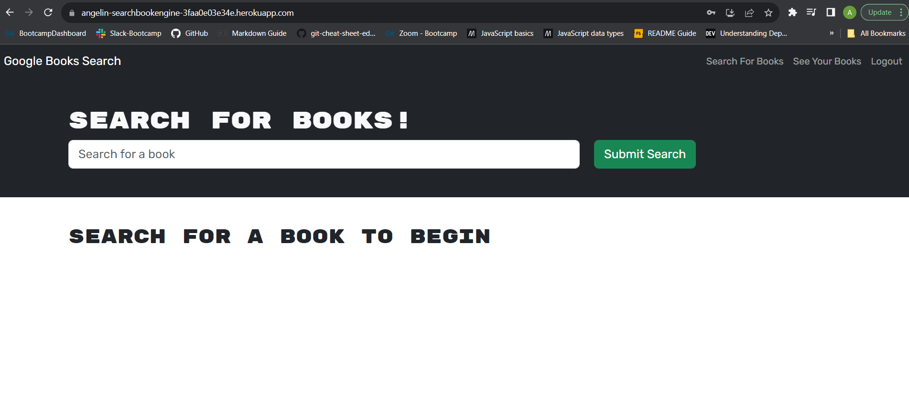

# Angelin_bookSearchEngine

This web application is a Google Books search engine powered by GraphQL. It allows users to search for books, create accounts, save books, and manage their saved book list. Built using the MERN stack (MongoDB, Express.js, React, and Node.js) with the Apollo Server and GraphQL, it offers a performant and user-friendly experience for avid readers.

## Deployed Websites URL from Heroku: 
https://angelin-searchbookengine-3faa0e03e34e.herokuapp.com/

## Table of Contents

- [Usage](#usage)
- [Features](#features)

## Usage

* The Book Search Engine is designed for avid readers who want to discover new books to read and maintain a list of books to purchase. Here are some key features:

* Search for Books: Search for books by entering keywords in the search box.

* User Authentication: Create an account or log in to your existing account to save and manage books.

* Save Books: When logged in, you can save books to your account for future reference.

* View Saved Books: Access your saved books to see a list of books you've saved.

* Remove Books: Remove books from your saved books list if you no longer want them.

## Features

### Search for Books
* When you load the Book Search Engine, you are presented with a menu that includes options to "Search for Books" and "Login/Signup."

* If you click on the "Search for Books" menu option, you will see an input field to search for books and a submit button. Enter a search term, and you'll be presented with a list of search results, each featuring a book's title, author, description, image, and a link to the book on the Google Books site.

* If you enter a search term and click the submit button while not logged in, you'll still receive search results.

### User Authentication
* Clicking on the "Login/Signup" menu option opens a modal with the option to log in or sign up.

* For sign up, you will be prompted to provide a username, email address, and password. After signing up, you'll be logged in.

* For login, enter your email address and password to log in, and the modal will close.

### Saving and Managing Books
* When you are logged in, you can save books to your account. For each search result, there is a "Save This Book!" button. Click this button to save a book.

* The menu options change when you are logged in. You'll see options to "Search for Books," view your saved books, and "Logout."

* You can view your saved books on a separate page, displaying the book's title, author, description, image, and a link to the Google Books site.

* Remove books from your saved list by clicking the "Remove" button.

* Clicking the "Logout" button logs you out and presents the menu with the options to "Search for Books" and "Login/Signup."

## Deployment Steps

* Login into heroku : heroku login
* Initialize a Git Repository: If your project is not already a Git repository, run the following commands in your project's root directory:

git init
git add .
git commit -m "Initial commit"

* Create a Procfile: Heroku needs a Procfile to know how to run your application. Create a file named Procfile (without any file extension) in your project's root directory

* Push to Heroku: Deploy your application to Heroku by running the following commands:

heroku create Angelin_bookSearchEngine
git push heroku main

* Open the App: After a successful deployment, you can open your app in the browser using the Heroku app URL

* Screenshot of deployed website: 

### Outside resources: 
* Tutoring
* ChatGPT
* Challenge assignment for react and mern
